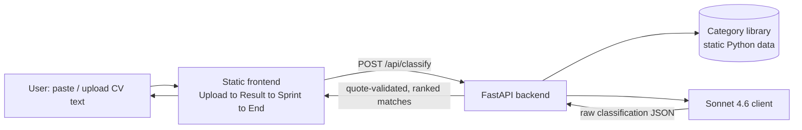

# ProofPath — Engineering Design Doc

**Author:** TBD
**Status:** Draft v0.2 — supersedes v0.1's keyword-matching architecture
**Last updated:** 2026-06-23
**Reviewers:** TBD

> **Changelog (v0.2):** v0.1 deliberately rejected an LLM call in favor of client-side regex matching (see the original Decision 1 in Section 8, kept below for context). That decision is now reversed: classification moves to a Python backend that calls Claude Sonnet 4.6. This is the evolution product.md Section 6 explicitly anticipated — "the part worth protecting most carefully as the product evolves past keyword matching" is the quoted-evidence mechanic, which this version preserves by validating every LLM-returned quote against the real CV text rather than trusting it blindly.

---

## 1. Summary

ProofPath is a small web app: paste or upload a CV, get it classified against a hand-curated library of five career fields by Claude Sonnet 4.6, receive the single highest-confidence field as one title with quoted evidence pulled from the actual CV text, work through a hand-authored 1-week try-it sprint, and self-report fit or no-fit. The frontend is the same static four-screen flow as v0.1 (Upload → Result → Sprint → End); what changed is that classification now happens server-side via a small FastAPI backend (Python, managed with `uv`) that calls the Anthropic API instead of running a regex scorer in the browser. The single most interesting engineering choice in this version is not "use an LLM" — that part is now a given — it's the **quote-validation guard**: every piece of "evidence" the model returns is checked as a real, case-insensitive substring of the CV the user actually submitted before it's allowed to reach the screen. The product's credibility rests entirely on the evidence feeling earned rather than generated, so a hallucinated quote is treated as a correctness bug, not a quality nit.

## 2. Assumptions

- **Target scale:** still a small pilot — low hundreds of users, drawn initially from the same population as the original interviews. Not designed past that.
- **Latency budget:** one Sonnet API call per CV submission, roughly 1–4 seconds round-trip. This is a new, real loading state that v0.1 didn't need — see Section 9 and the open question for UX in Section 13.
- **Platform:** web frontend (static HTML/CSS/JS, no build step, no Node required) talking to a Python backend over one JSON endpoint.
- **Cost ceiling:** no longer $0 — each classification call costs real money (Section 12 has the estimate), but it's small at pilot scale.
- **Secrets:** `ANTHROPIC_API_KEY` is **not yet configured** in this environment. The code reads it from `.env` and fails loudly (not silently) if it's missing. All automated tests mock the Anthropic client entirely — no test in this repo makes a real network call or requires a real key.
- **Out of scope:** accounts, multi-device sync, persistence, localization — unchanged from v0.1.

## 3. Goals & non-goals

**Goals (v0.2):**
- Classify pasted or uploaded CV text against the five curated career-field categories using Claude Sonnet 4.6, and return one ranked, evidence-backed title — not a list
- Every evidence quote shown to the user must be a real, verifiable substring of the CV they submitted — never a paraphrase or a fabrication
- Keep the hand-authored sprint/skills/timeline content exactly as specific as it was in v0.1; the LLM classifies, it does not generate sprint content
- On a "no fit" verdict, cycle to the next-ranked title from the same API response with no second call and no re-submission
- Fail clearly, not silently, when the LLM call fails, times out, or returns something unparseable

**Non-goals (v0.2):**
- Not designed for any user base beyond a low-hundreds pilot
- No streaming responses — classification is one request/response, not a token stream
- No persistence layer (carried over from v0.1 — still an open risk, not solved here)
- No multi-language support
- No dev server is started as part of this build — running the app live is explicitly a later step

## 4. Architecture



**What's here:**
- **Static frontend** — the same four-screen shape as v0.1 (Upload, Result, Sprint, End), vanilla HTML/CSS/JS, no framework, no Node build step. The only behavioral change is that "Find my title" now makes one network call instead of running a local function.
- **FastAPI backend** (`app/`, Python, dependencies managed with `uv`) — one real endpoint, `POST /api/classify`. Validates input, calls the LLM client, validates the LLM's quotes against the real CV text, merges the result with hand-authored category content, returns the full ranked array.
- **Sonnet 4.6 client** (`app/llm_client.py`) — the only module that talks to the network. Reads `ANTHROPIC_API_KEY` from `.env`, builds the classification prompt, calls the model, parses the response into a typed object.
- **Category library** (`app/categories.py`) — the same five hand-authored fields as v0.1 (title, description, example paths, 7-day sprint, skills, timeline), now in Python. This is also the closed set the LLM is told to classify against — it is never asked to invent a category.

**What's deliberately NOT here:**
- **No database** — the category library is static config shipped with the app. CV text passes through the backend in-memory for the duration of one request and is not logged or stored.
- **No LLM call from the browser** — the Anthropic key never reaches the client; the frontend only ever talks to our own backend.
- **No streaming** — a single JSON response per call; there's no incremental UI to stream into.
- **No persistence layer** — sprint checklist state is still in-memory only in the browser, same accepted gap as v0.1 (see Risks).
- **No auth, no accounts, no multi-tenancy** — one stateless endpoint, no sessions.

## 5. Key components

### Frontend input layer

- **Responsibility:** get CV text into a single string and POST it to the backend, regardless of source (paste, file, or sample).
- **Tech choice:** plain `<textarea>` plus the browser `FileReader` API for `.txt` files; `fetch()` for the API call.
- **Why this choice:** unchanged from v0.1 — zero dependencies, no build step. PDF parsing is still explicitly deferred (Section 14).
- **Interface:** `POST /api/classify` with `{ "cv_text": string }`.

### Classification endpoint (`app/main.py`)

- **Responsibility:** validate the request, call the LLM client, validate its output, attach hand-authored content, return the ranked array.
- **Tech choice:** FastAPI route handler with Pydantic request/response models.
- **Why this choice:** Pydantic gives free input validation (rejects too-short `cv_text` with a 422 before any paid API call happens) and FastAPI's `TestClient` lets the integration tests exercise the full route in-process, with no real server bound to a port.
- **Interface:** see Section 7.

### Sonnet 4.6 client (`app/llm_client.py`)

- **Responsibility:** build the classification prompt (CV text + the five categories' id/title/description), call Claude Sonnet 4.6, and return a parsed, typed result.
- **Tech choice:** the official `anthropic` Python SDK, model `claude-sonnet-4-6`, a single `messages.create` call with explicit instructions to return JSON matching a documented schema (Anthropic has no enforced `response_schema` the way some other providers do, so the schema is enforced by prompt instructions plus strict server-side parsing/validation on the way back).
- **Why this choice:** keeping the only network-touching code in one small, easily-mocked module is what makes the test suite in Section 10 possible without a real API key. One retry on a transient failure or a JSON parse miss lives here, not scattered through the route handler.
- **Interface:** `classify_cv(cv_text: str, categories: list[Category]) -> LLMClassification`, where `LLMClassification` is a list of `{category_id, confidence, evidence_quotes}`.

### Quote validator (`app/classifier.py`)

- **Responsibility:** for every quote the LLM claims as evidence, confirm it is an actual case-insensitive substring of the submitted CV text. Drop anything that isn't.
- **Tech choice:** plain Python string containment (`quote.lower() in cv_text.lower()`), no fuzzy matching, no second LLM call to "double check."
- **Why this choice:** this is the load-bearing piece of the entire rewrite. Product.md is explicit that the quoted-evidence mechanic is "the part worth protecting most carefully as the product evolves past keyword matching" — a fabricated quote would be worse than no quote at all, because it would look exactly as credible as a real one. A dumb, literal substring check is the simplest thing that can't be fooled by a confident-sounding hallucination.
- **Interface:** `validate_quotes(cv_text: str, quotes: list[str]) -> list[str]`.

### Evidence-text formatter (`app/classifier.py`)

- **Responsibility:** turn a list of *validated* quotes into the one rendered evidence sentence shown on the Result screen — e.g. "We found 'governance' and 'monitoring' in what you pasted — that's a pattern, not a coincidence."
- **Tech choice:** deterministic Python string formatting, ported directly from v0.1's `buildWhyText` punctuation logic (handles 0 / 1 / 2 / 3+ quote cases the same way).
- **Why this choice:** the model classifies and extracts quotes; it does not write the sentence shown to the user. Keeping sentence construction deterministic preserves the exact, deliberately blunt microcopy voice ui.md specifies, and keeps this piece unit-testable without mocking anything.
- **Interface:** `format_evidence_text(quotes: list[str]) -> str`.

### Category library (`app/categories.py`)

- **Responsibility:** hold the five hand-authored fields — id, title, a short semantic description (new: this is what grounds the LLM's classification, replacing the keyword list), example paths, 7-day sprint, skills, timeline.
- **Tech choice:** a static list of Pydantic model instances in one module.
- **Why this choice:** unchanged rationale from v0.1 — this content has to stay hand-written to feel specific and earned; a static module is the simplest thing that can hold it. It now does double duty as the closed classification target the LLM is constrained to.
- **Interface:** `CATEGORIES: list[Category]`, imported by both the prompt builder and the response merger.

### Frontend screen router + verdict cycler

- **Responsibility:** show exactly one of four screens at a time, and track which ranked match from the API response is "active" so a "no fit" tap can advance without a second network call.
- **Tech choice:** plain DOM class toggling, no router library — unchanged from v0.1.
- **Interface:** `showScreen(name)`, plus a module-level `currentIndex` into the `matches` array returned by `/api/classify`.

## 6. Data model

```python
# app/categories.py
class Category(BaseModel):
    id: str                          # "governance" | "datasci" | "webdev" | "digitalhealth" | "bizops"
    title: str                       # e.g. "Monitoring & Evaluation (M&E) Associate"
    description: str                 # short semantic grounding text fed to the LLM prompt
    examples: list[str]              # 2-3 short "someone like you" narratives
    sprint: list[str]                # exactly 7 entries, one per day
    skills: list[str]                # skills to build, shown as tags
    timeline: list[tuple[str, str]]  # exactly 3 phases: (label, description)

# app/models.py
class ClassifyRequest(BaseModel):
    cv_text: str                     # min_length validated (~30 chars, same floor as v0.1)

class RankedMatch(BaseModel):
    category_id: str
    title: str
    confidence: float                # 0-100, assigned by the LLM
    evidence_quotes: list[str]       # validated substrings of cv_text only
    evidence_text: str               # deterministically formatted, never LLM prose
    examples: list[str]
    sprint: list[str]
    skills: list[str]
    timeline: list[tuple[str, str]]

class ClassifyResponse(BaseModel):
    matches: list[RankedMatch]       # all 5 categories, sorted descending by confidence

# app/llm_client.py (internal, not exposed over the API)
class LLMCategoryResult(BaseModel):
    category_id: str
    confidence: float
    evidence_quotes: list[str]       # raw, NOT yet validated

class LLMClassification(BaseModel):
    results: list[LLMCategoryResult]
```

**Notes:**
- The category library is still configuration, not user data — no retention policy or PII concern there.
- The only user data in the system is the submitted `cv_text`. It lives in the request lifecycle only: it's sent to Anthropic as part of the prompt, used for quote validation, and then discarded — never written to disk, never logged in full. This is a real, named change from v0.1 (see Risks, Section 9): CV text now leaves the device, which v0.1 treated as a privacy strength for this specific user base.
- `ClassifyResponse.matches` is intentionally the full ranked list, all five categories, not just the winner — same reason as v0.1: the frontend needs the whole array to cycle through "no fit" without a second call.

## 7. API surface

### `POST /api/classify`

- **Request body:** `{ "cv_text": string }`
- **Success response (200):** `{ "matches": RankedMatch[] }` — all five categories, sorted descending by `confidence`.
- **Validation error (422):** `cv_text` shorter than the minimum length. The Anthropic client is never called in this case — validate before paying for a call.
- **Upstream failure (502):** the Sonnet call errors, times out, or returns JSON that fails to parse against `LLMClassification` even after one retry. Response body is a plain, user-readable message (`{"detail": "Couldn't reach the matching service. Try again in a moment."}`), never a raw stack trace.
- **Latency budget:** roughly 1–4 seconds, dominated by the Sonnet round-trip. This is a real loading state the frontend needs that v0.1 didn't (flagged as an open item for UX in Section 13 — ui.md's Result screen currently says "Loading: none on this screen").

### Internal call graph (no other network-facing endpoints)

- `classify_cv(cv_text, categories) -> LLMClassification` — the only function that calls Anthropic.
- `validate_quotes(cv_text, quotes) -> list[str]` — pure, no I/O.
- `format_evidence_text(quotes) -> str` — pure, no I/O.
- `build_classification_prompt(cv_text, categories) -> str` — pure, no I/O; used by `classify_cv` and tested independently of the network call.

## 8. Key trade-offs (with rejected alternatives)

### Decision (revised): LLM-based semantic classification vs. continuing client-side keyword scoring

- **Chose:** server-side classification via Claude Sonnet 4.6, with every returned quote validated against the real CV text before display.
- **Previously chose (v0.1):** deterministic regex/keyword matching, entirely client-side, explicitly to avoid the cost, latency, and privacy exposure of a model call.
- **Why we're reversing it now:** v0.1's own Risks section (Section 9) flagged "keyword coverage gaps" as medium-high likelihood once the pilot extends past the original interview pool — CVs phrased in vocabulary outside the curated keyword lists would get a poor or no match no matter how good the category library is. Semantic classification fixes exactly that failure mode. Product.md's signature-detail section explicitly named this as an expected evolution, on the condition that the evidence-quoting mechanic survive the transition credibly — which is why quote validation (Section 5) is treated as mandatory infrastructure, not a nice-to-have.
- **What we're giving up, eyes open:** CV text now leaves the device (a real privacy regression for a user base where several interviewees described visa and legal sensitivity); cost is no longer $0; latency goes from sub-50ms to 1–4 seconds; and the system now has a new failure mode (LLM call failure) that didn't exist before. All three are accepted trade-offs for this version, not oversights — each has a corresponding mitigation in Section 9.

### Decision: hand-curated, closed category set vs. open-ended/dynamically generated categories

- **Chose (unchanged from v0.1):** five hand-authored categories with all sprint content, skills, and timelines written by a human in advance; the LLM classifies against this closed set and is never allowed to invent a sixth.
- **Why this still holds:** sprint content has to stay hand-written to feel specific and credible — letting the model generate "Day 3: do something related to your field" would gut the part of the product that makes the week feel like real proof. Constraining the LLM to a closed category list also reduces hallucination surface area: it's choosing among five well-described options, not freely generating a job title from scratch.

### Decision: deterministic server-side sentence formatting vs. letting the LLM write the evidence prose

- **Chose:** the LLM's job stops at classification + quote extraction. A plain Python function (`format_evidence_text`) builds the actual sentence shown to the user from the validated quotes.
- **Considered:** asking the LLM to write the full "why this title" sentence directly.
- **Why we picked this:** ui.md specifies an exact, deliberately blunt microcopy voice ("that's a pattern, not a coincidence," never "Congratulations!"). Generated prose drifts in tone across calls; a deterministic formatter doesn't. It's also the difference between a function that needs a mocked LLM to test and one that's a two-line pure-function unit test (Section 10).

### Decision: FastAPI vs. Flask/Django for the backend

- **Chose:** FastAPI.
- **Why this choice:** one real endpoint, fully typed via Pydantic, with a built-in `TestClient` that lets integration tests exercise the whole route in-process without binding a port — directly relevant given this build explicitly must not start a dev server. Flask would need an extra library (`flask.testing` is close but less ergonomic with Pydantic); Django is far more machinery than one endpoint justifies.

### Decision: vanilla JS frontend vs. a framework-based build (carried over from v0.1)

- **Chose (unchanged):** one static HTML/CSS/JS frontend, no build step, no Node dependency for the app itself.
- **Why this still holds:** four screens, no routing beyond show/hide, no complex shared state. Adding a backend didn't change this calculus — the new complexity is server-side, not in the UI layer.

## 9. Risks & unknowns

- **CV text now leaves the device** — this reverses a property v0.1 explicitly called a strength for this user base (visa/legal sensitivity, P2/P3's circumstances). Likelihood: certain — this is a property of the new architecture, not a bug. Mitigation: never log or persist `cv_text` beyond the request lifecycle; state this plainly to pilot users before launch, framed as a real trade-off, not buried in fine print.
- **Hallucinated evidence quotes** — Sonnet could return a "quote" that isn't actually in the CV. Likelihood: low but non-zero with any LLM. Mitigation: the quote validator (Section 5) strips any non-substring match before a response leaves the backend; if validation strips every quote for a category, fall back to the same "we matched this from the overall shape of what you pasted" sentence v0.1 used for the zero-hits case.
- **LLM call failure, timeout, or malformed JSON** — network blip, rate limit, or a response that doesn't parse against the expected schema. Likelihood: low per-call, but non-zero at any real volume. Mitigation: one retry inside `llm_client`, then a clean 502 with a readable message; never silently return fabricated or zeroed results on failure.
- **Misclassification / low-confidence matches** — semantic classification can be wrong in ways keyword matching wasn't (confidently wrong, rather than visibly zero-score). Likelihood: medium, unverified until real pilot CVs are tried. Mitigation: surface `confidence` to the frontend so a future UX pass can add a confidence floor (open question, Section 13) — not solved in this version.
- **Cost is no longer $0** — every submission now costs a real API call. Likelihood: certain, low impact at pilot scale (Section 12 has the estimate). Mitigation: track call volume during the pilot; the model string is pinned in one place (`llm_client.py`) so cost/behavior changes from a future model upgrade are a one-line diff, not a hidden surprise.
- **No persistence still loses multi-day sprint progress** (carried over from v0.1, unchanged) — Mitigation unchanged: add `localStorage`-backed progress before the next real pilot round; still the single highest-priority *frontend* follow-up.
- **Prompt/model drift over time** — Anthropic updating Sonnet's behavior could shift classification results without any code change on our side. Likelihood: low within a pilot's timeframe. Mitigation: the two hardcoded sample CVs from v0.1 double as a lightweight regression check — run them by hand whenever the model string changes.

## 10. Testing strategy

**Unit tests (`tests/test_classifier.py`, `tests/test_llm_client.py`, `tests/test_categories.py` — no network, no mocks needed beyond what's noted):**
- `validate_quotes(cv_text, quotes)` — given quotes that ARE real case-insensitive substrings of `cv_text`, returns them unchanged; given a quote that is NOT a substring, drops it; given a mix of valid and invalid quotes, returns only the valid ones.
- `format_evidence_text(quotes)` — given 0, 1, 2, and 3+ quotes, produces correctly punctuated sentences ("X", "X and Y", "X, Y, and Z"); given an empty list, returns the defined fallback sentence rather than an empty or broken string.
- `build_classification_prompt(cv_text, categories)` — asserts the rendered prompt string contains the CV text verbatim and every category's `id` and `title`, so a future category-list edit can't silently vanish from what the model sees.
- `parse_llm_response(raw_json)` (in `llm_client.py`) — given a well-formed JSON string matching `LLMClassification`'s schema, returns a correctly parsed object; given malformed or missing-field JSON, raises a clear, typed `ClassificationParseError` rather than a bare `KeyError` or `ValidationError` leaking up.
- **Category data integrity** — every entry in `CATEGORIES` has all required fields correctly shaped: `description` non-empty, `examples` length 2–3, `sprint` length exactly 7, `skills` non-empty, `timeline` length exactly 3. Catches a broken content edit before it reaches a user.

**Integration tests (`tests/test_api.py`, using FastAPI's `TestClient` — the Anthropic client is mocked in every single test in this file; none make a real network call or require `ANTHROPIC_API_KEY` to be set):**
- **Happy path, fit:** mock `classify_cv` to return a canned `LLMClassification` ranking category `webdev` highest, with evidence quotes drawn verbatim from a fixed sample CV string → `POST /api/classify` → assert `200`, `matches[0].category_id == "webdev"`, `evidence_quotes` non-empty and every quote present in the submitted `cv_text`, and that `sprint`/`skills`/`timeline` on the response come from the static category library, not from the mocked LLM output.
- **No-fit cycling (response shape):** mock `classify_cv` to rank two categories closely → `POST /api/classify` → assert `matches` is sorted descending by `confidence` and contains all five categories, confirming the frontend can cycle through "no fit" using this one response with zero additional calls.
- **Hallucinated-quote handling:** mock `classify_cv` to return a quote that does **not** appear anywhere in the submitted `cv_text` → `POST /api/classify` → assert that quote is absent from the response's `evidence_quotes`, and that `evidence_text` still renders a coherent sentence (using the fallback if every quote for that category was stripped) rather than ever surfacing a fabricated quote.
- **Insufficient input:** `POST /api/classify` with `cv_text` under the minimum length → assert `422`, and assert the mocked `classify_cv` was never called (`mock.assert_not_called()`) — validate before paying for a call.
- **LLM failure:** mock `classify_cv` to raise → `POST /api/classify` → assert a clean `502` with a readable `detail` message, not an unhandled `500`.

**Deliberately not tested (and why):**
- **Visual styling and layout** — unchanged from v0.1: purely visual, caught by human review.
- **PDF parsing** — still not implemented; nothing to test until it's built.
- **Drag-and-drop file upload** — still not implemented; only click-to-browse exists.
- **Cross-browser rendering quirks** — single internal pilot audience for now.
- **Quality/relevance of hand-authored sprint content** — a content judgment call, not a unit-testable property.
- **The real Sonnet model's actual classification accuracy** — whether it correctly identifies a "Junior Web Developer" CV from real-world phrasing is a prompt-quality and model-behavior question, evaluated by hand against real sample CVs during the pilot (using the two hardcoded sample CVs as a starting point), not something a mocked test can verify. The automated suite verifies the *plumbing* — validation, formatting, error handling, response shape — is correct; it does not and cannot verify the model is smart.
- **Real network calls to Anthropic, anywhere in this suite** — `ANTHROPIC_API_KEY` is not configured in this environment. Every test that touches `classify_cv` mocks it at the `app.llm_client` module boundary. Tests must stay deterministic and free.

**Stack defaults:**
- `pytest`, run via `uv run pytest -v` from the project root.
- FastAPI's `TestClient` for `test_api.py` — runs the app in-process, binds no real port, starts no server.
- Mocks via `unittest.mock.patch("app.main.classify_cv", ...)` — patched at the boundary where the route calls into the LLM client, not deep inside the Anthropic SDK.
- Tests live in `tests/`, one file per `app/` module (`test_classifier.py`, `test_llm_client.py`, `test_categories.py`, `test_api.py`).

## 11. Rollout & monitoring

- **Rollout:** unchanged in spirit from v0.1 — share with a handful of pilot users from the original interview pool first. The new step: confirm `ANTHROPIC_API_KEY` is set in the deployment environment before any real traffic hits `/api/classify` (it is deliberately not set in this dev environment yet).
- **Feature flags:** still none needed at this scale.
- **Monitoring (new, since there's now a real backend):** track Sonnet call success/failure rate, p50/p95 latency, and per-call token usage. At pilot scale this can be a simple structured log line per request rather than a dashboard.
- **Rollback plan:** revert to the previous backend + frontend version. Slightly more moving parts than v0.1's "revert one static file," but still no database migrations or stateful rollback concerns.

## 12. Cost & capacity

- **Per-call cost estimate:** Claude Sonnet 4.6 is priced at $3 per million input tokens and $15 per million output tokens (Anthropic's published API pricing, June 2026). A classification call sends the CV text plus five short category descriptions as input (roughly 800–1,500 tokens for a typical one-to-two-page CV) and gets back a small structured JSON result (roughly 200–400 tokens). That puts a single call at roughly **$0.005–$0.01**.
- **Monthly budget at pilot scale (low hundreds of users, ~1–2 calls per CV including a no-fit cycle's worth of re-tries):** well under $5/month in model cost. Negligible relative to engineering time at this stage.
- **What breaks at 10× scale:** still not infrastructure — FastAPI plus a stateless Anthropic call scales horizontally trivially. The real bottleneck is the same one v0.1 had: the five hardcoded categories. Semantic classification handles more phrasing variety than keyword matching did, but it still can't classify a CV into a field that isn't in the library. Content coverage, not infrastructure, is still the 10×-scale constraint.

Sources: [Pricing - Claude API Docs](https://platform.claude.com/docs/en/about-claude/pricing), [Claude Sonnet 4.6 API Pricing 2026](https://pricepertoken.com/pricing-page/model/anthropic-claude-sonnet-4.6)

## 13. Open questions

- [ ] The Result screen now needs a real loading state (1–4 second Sonnet round-trip) that ui.md's current spec says doesn't exist ("Loading: none on this screen"). Does UX want a spinner, a skeleton, or copy that fills the wait? — UX
- [ ] Should `confidence` be surfaced to the user at all, or only used internally to rank/cycle matches? Product.md's Open Questions already ask about a "confidence floor" for thin matches — this version finally has a real confidence number to hang that decision on. — PM + UX
- [ ] Now that CV text leaves the device, does this need to be disclosed to pilot users more explicitly than a privacy-policy footnote, given the visa/legal sensitivity named in product.md Section 1? — PM
- [ ] Should sprint-day checkbox state move to `localStorage` before the next pilot round? (carried over from v0.1, still unresolved) — Eng

## 14. Out of scope (will not do)

- **No database, auth, or multi-tenant anything** — one stateless classification endpoint.
- **No PDF parsing or OCR** — `.txt` upload and paste remain the only input paths.
- **No streaming UI** — classification is one request/response.
- **No prompt-caching or batch-API cost optimization** — not worth the complexity at pilot-scale call volumes (Section 12); revisit only if volume grows materially.
- **No persistence for sprint progress** — carried over from v0.1, still an accepted gap, not solved by this rewrite.
- **No localization or Burmese-language support** — unchanged from v0.1.
